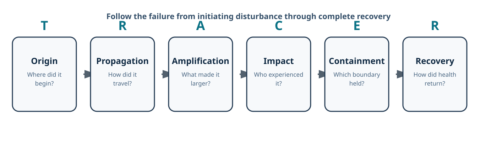

# The Geometry of Incidents

**Turn a production incident into an architecture review - and each finding
into a resilience test.**

The geometry of incidents is an evidence-based review technique for tracing
where a production failure began, how the architecture carried and amplified
it, what limited its reach, and why recovery took the shape it did.

> Incidents do not spread randomly. They follow the architecture.



**Start here:** [Try it in 5 minutes](docs/try-it-in-5-minutes.md) ·
[Run a 30-minute review](docs/getting-started.md) ·
[Copy the review template](templates/tracer-review-template.md) ·
[See a completed example](case-studies/crowdstrike-2024.md)

The repository contains the framework, reusable review templates, four
source-backed case studies, and a starter corpus.

*This is an independent personal project. It is not affiliated with or endorsed
by my employer or by the organizations discussed in the case studies.*

## Why I built this

Across hundreds of public postmortems, I kept seeing different root causes
produce familiar impact and recovery patterns. I built the Geometry of
Incidents method to connect those patterns to the architectural paths that
carried and amplified the failure, so a review can lead to a better design
question rather than stop at a timeline. The motivation and two early examples
are described in my
[WeAreDevelopers article](https://www.wearedevelopers.com/magazine/764-the-geometry-of-incidents-connecting-user-impact-to-architecture).

## Try the idea before adopting the framework

The shortest useful Geometry of Incidents statement has seven lines:

```text
Observable: What user- or workload-visible quantity changed?
Origin: Where did the disturbance begin?
Propagation: Which path carried it?
Amplification: What made it larger, faster, or persistent?
Impact and containment: Who experienced it, and which boundary held or failed?
Recovery: What restored service, correctness, and accumulated work?
Test: What experiment would verify the proposed protection?
```

The [5-minute exercise](docs/try-it-in-5-minutes.md) walks through a compact
CrowdStrike example and then applies these prompts to one of your incidents.

## 1. What is the geometry of incidents?

The review follows the failure through six stages:

```text
Origin -> Propagation -> Amplification -> Impact -> Containment -> Recovery
```

**TRACER** is the mnemonic used in the conference talk:

| TRACER | Formal term | Question |
| --- | --- | --- |
| Trigger | Origin | Where did the disturbance begin? |
| Route | Propagation | How did it travel? |
| Amplification | Amplification | What made it larger, faster, or persistent? |
| Consequence | Impact | Who or what experienced the failure? |
| Extent | Containment | What limited its extent, and which boundary failed? |
| Recovery | Recovery | How did the system return to health? |

The reviewer names one user-impact observable and describes its curve over
time. That curve is kept separate from the causal geometry. A global fan-out
may produce a cliff in failed requests; synchronized recovery may produce a
wave of repair work. Neither curve proves the mechanism by itself.

Read the [framework](docs/framework.md) and
[vocabulary](docs/vocabulary.md) for the complete model.

## 2. How is it different from a timeline or root-cause analysis?

Each method answers a different question:

| Method | Primary question |
| --- | --- |
| Timeline | What happened, and when? |
| Root-cause analysis | What initiated the failure, and why? |
| Blast radius | How much was affected? |
| Geometry of incidents | How did the architecture transform the initiating fault into this pattern of impact and recovery? |

Use it alongside the timeline and causal analysis. It adds the structural view:
the paths that carried failure, the mechanisms that enlarged it, the boundaries
that held or failed, and the work required to recover.

## 3. How do I apply it to one incident?

1. Name one user- or workload-visible observable and its units.
2. Establish reported facts from the timeline and primary evidence.
3. Walk through TRACER without forcing the incident into one label.
4. Name the observable's curve separately from causal mechanisms.
5. Identify the boundary that held, failed, or was missing.
6. Convert each finding into a control and a verification test.

Start with the [30-minute guide](docs/getting-started.md) and copy the
[TRACER review template](templates/tracer-review-template.md). Use the
[coding template](templates/incident-coding-template.csv) when comparing
multiple incidents.

## 4. Where can I see a complete example?

Start with the [CrowdStrike 2024 case study](case-studies/crowdstrike-2024.md).
Automated one-to-many distribution produced a cliff in affected Windows hosts;
host-by-host remediation produced the long recovery tail.

Additional cases:

- [Cloudflare WAF, 2019](case-studies/cloudflare-2019.md) - global fan-out and a sharp recovery
- [GitHub database failover, 2018](case-studies/github-2018.md) - cascade, divergent state, and backlog recovery
- [AWS DynamoDB US-EAST-1, 2025](case-studies/aws-dynamodb-2025.md) - fan-out, cascade, synchronized repair, and congestive collapse

## Repository map

- [`docs/`](docs/) - framework, vocabulary, adoption guide, and limitations
- [`templates/`](templates/) - reusable review and coding forms
- [`case-studies/`](case-studies/) - facts separated from project interpretation
- [`data/`](data/) - starter corpus and data dictionary
- [`figures/`](figures/) - reusable project-authored diagrams

## Evidence and interpretation

Factual claims in the case studies cite operator reports and other first-party
sources. Geometry labels are our interpretation, not the operators' wording.
When the public record does not support a metric, the field stays unknown.

See [limitations](docs/limitations.md) before applying the framework to research
or automated classification.

## Project status

Version 0.1.0 is a working practitioner framework. The method and vocabulary
are ready to use and challenge, but they have not been validated as a
predictive taxonomy. Independent case studies, classification reviews, and
counterexamples are especially welcome.

To test the method against a different incident, [propose a case study](https://github.com/subbukambala/the-geometry-of-incidents/issues/new?template=case-study.yml).
You can author the analysis, review someone else's classification, check its
sources, or simply suggest a useful case.

## Citation and license

Citation metadata is available in [`CITATION.cff`](CITATION.cff). Unless a file
states otherwise, this repository is licensed under the
[Creative Commons Attribution 4.0 International License](LICENSE).

Contributions are welcome through the process in
[`CONTRIBUTING.md`](CONTRIBUTING.md).
