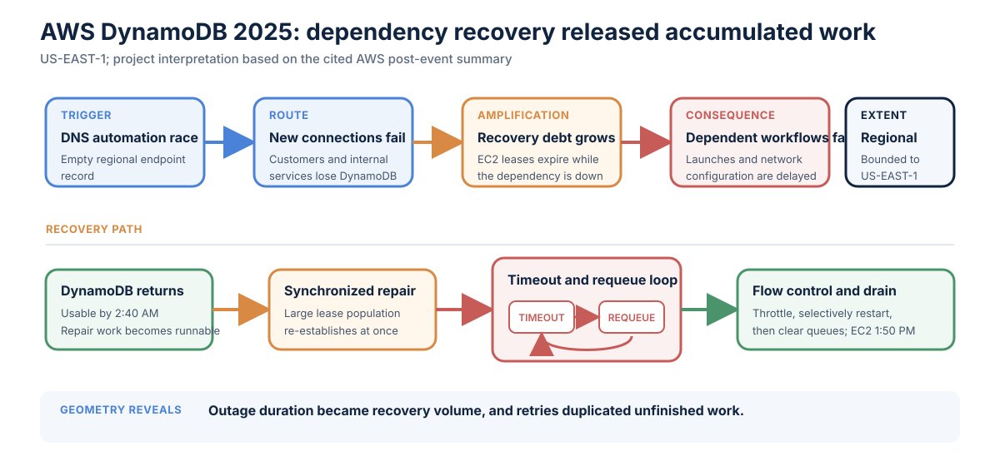

# AWS US-EAST-1 DynamoDB DNS incident, 2025

**Incident:** October 19-20, 2025<br>
**Primary observable:** Failed new connections to the regional DynamoDB endpoint<br>
**Evidence status:** AWS post-event summary<br>
**Classification status:** Project interpretation

This review covers the October 2025 incident, not the September 2015 DynamoDB
metadata-service disruption.

## Reported facts

AWS reported that a latent race condition in DynamoDB's automated DNS-management
system produced an empty DNS record for the US-EAST-1 regional endpoint that
automation could not repair. From 11:48 PM PDT on October 19 through 2:40 AM PDT
on October 20, customers and internal AWS services could not establish new
connections to DynamoDB through the regional endpoint.[^aws]

While DynamoDB was unavailable, EC2 Droplet Workflow Manager lease checks
failed and leases gradually expired. When DynamoDB returned, the system began
re-establishing a large number of leases. Work timed out and was queued again;
AWS describes the resulting state as congestive collapse. Engineers throttled
incoming work, selectively restarted workers, and cleared queues. Full EC2
recovery occurred at 1:50 PM PDT.[^aws]

## Classification

| Layer | Reading |
| --- | --- |
| User-impact curve | DynamoDB connection **cliff**; downstream **recovery wave** and **long-tail recovery** |
| Causal geometries | DynamoDB **fan-out**, downstream **cascade**, **synchronization**, and retry **feedback loop** |
| Amplification | Expiring leases, accumulated repair work, timeouts, and requeued attempts |
| Supporting properties | State accumulation, recovery asymmetry, and regional control-plane coupling |

## Geometry of incidents diagram



This diagram covers the October 2025 DNS incident. It does not depict the
September 2015 DynamoDB metadata-service incident used in some conference
materials.

## TRACER analysis

### Trigger / origin

A stale concurrency check allowed an older DNS plan to overwrite a newer plan;
cleanup then removed the endpoint addresses and left state that required manual
operator repair.[^aws]

### Route / propagation

Customer applications and internal services lost new DynamoDB connections. One
downstream path ran from DynamoDB through EC2 lease management, new-instance
launch capacity, network-state propagation, Network Load Balancers, and other
dependent services.

### Amplification

The outage accumulated recovery debt as leases expired. DynamoDB restoration
made that work runnable in a narrow window. Attempts exceeded their timeouts,
were requeued, and prevented forward progress.

```text
Dependency outage
-> expired state accumulates
-> repair work activates together
-> attempts time out
-> retries enlarge the queue
-> recovery slows
```

### Consequence / impact

Impact differed by operation and service. Existing EC2 instances generally
remained healthy, while new launches and subsequent network configuration were
affected. DynamoDB, EC2, NLB, Lambda, and other dependent workflows had
different impact and recovery windows.[^aws]

### Extent / containment

The fault remained in US-EAST-1, but several services inside the region shared
fate through DynamoDB and EC2 control paths. DNS restoration stopped the
initiating failure; it did not drain the repair queues. Engineers also needed
throttling, selective restarts, and queue control.

### Recovery

AWS restored the DNS information by 2:25 AM. As cached records expired,
customers recovered endpoint resolution and new connections by 2:40 AM, but
EC2 and dependent services continued to recover for hours. The longer EC2
recovery window exposed coupling that was not visible in the DNS failure alone.

## Architectural finding

Outage duration turned into recovery volume: leases expired, repair work became
runnable at once, and timeouts duplicated unfinished work.

[^aws]: Amazon Web Services, [Summary of the Amazon DynamoDB Service Disruption in the Northern Virginia (US-EAST-1) Region](https://aws.amazon.com/message/101925/), October 2025.
