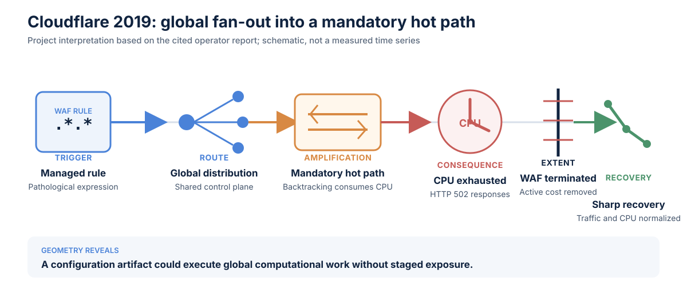

# Cloudflare WAF outage, 2019

**Incident:** July 2, 2019 
**Primary observable:** Failed or unserved HTTP and HTTPS requests 
**Evidence status:** Operator incident report 
**Classification status:** Project interpretation

## Reported facts

At 13:42 UTC, Cloudflare deployed a WAF managed rule containing a regular
expression that caused excessive backtracking. CPU exhaustion affected machines
serving HTTP and HTTPS traffic globally. Cloudflare globally terminated the WAF
at 14:07; traffic and CPU returned to expected levels by 14:09. Cloudflare
reported 27 minutes of impact.[^cf]

## Classification

| Layer | Reading |
| --- | --- |
| User-impact curve | **Cliff** with **sharp recovery** |
| Causal geometry | Global control-plane **fan-out** |
| Amplification | Pathological per-request CPU cost in a mandatory hot path |
| Supporting properties | Control-plane/data-plane coupling and weak rollout containment |

## Incident geometry diagram

The diagram is a project-authored causal schematic based on Cloudflare's
incident report. It is not a reconstructed request-error time series.

## TRACER analysis

### Trigger / origin

A WAF rule containing a computationally expensive regular expression entered
the production ruleset.

### Route / propagation

Cloudflare's rule-distribution path activated the configuration across the
global fleet. The same change reached many serving locations through a shared
control plane.

### Amplification

The rule executed on request traffic. Excessive backtracking consumed CPU in a
mandatory serving path, translating one configuration artifact into fleet-wide
capacity loss.

### Consequence / impact

Customers received HTTP 502 errors and traffic fell while CPU approached full
utilization across affected serving machines.[^cf]

### Extent / containment

The deployment path did not provide the staged containment used for ordinary
software releases. The decisive containment action was global WAF termination.

### Recovery

Once WAF execution was disabled, CPU and traffic returned quickly. Cloudflare
reported that both were back at expected levels within two minutes of the
global WAF termination.[^cf]

## Architectural finding

The rule path could distribute a change globally, but it did not impose a
comparable exposure boundary on the rule's computational cost.

## Design questions

- Does every production change class use staged exposure?
- Which resource guardrails automatically stop promotion?
- Can rollback controls remain available when the data plane is saturated?
- Does simulation still execute unsafe computational work?

## Controls to test

Staged rule rollout, CPU and latency promotion gates, regular-expression
complexity checks, automatic rollback, independent administrative access, and
bounded execution engines.

[^cf]: Cloudflare, [Details of the Cloudflare outage on July 2, 2019](https://blog.cloudflare.com/details-of-the-cloudflare-outage-on-july-2-2019/), July 12, 2019.
