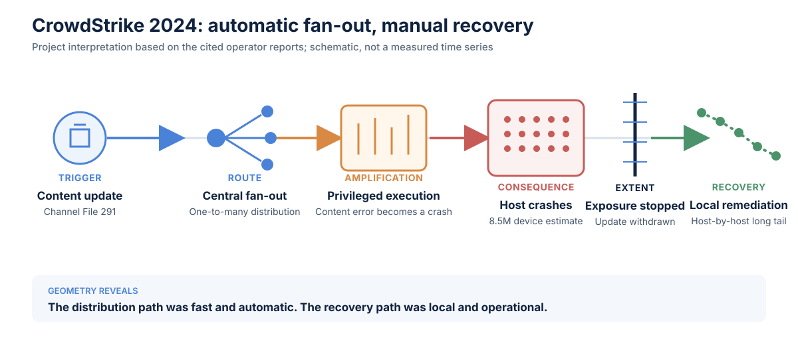

# CrowdStrike Falcon content update, 2024

**Incident:** July 19, 2024<br>
**Primary observable:** Windows hosts unable to operate normally<br>
**Evidence status:** Operator PIR and technical RCA, with Microsoft impact estimate<br>
**Classification status:** Project interpretation

## Reported facts

CrowdStrike released a Rapid Response Content update for Windows sensors at
04:09 UTC. Windows hosts running sensor version 7.11 or later that were online,
received the update, and processed the affected content could crash. CrowdStrike
reverted the content at 05:27 UTC; systems coming online afterward were not
affected by that content release.[^cs-pir]

CrowdStrike's technical RCA found that the sensor expected 21 data fields but
supplied only 20. A content update attempted to use the missing field,
triggering an out-of-bounds memory read and crashing the system.[^cs-rca]

Microsoft estimated that the update affected 8.5 million Windows devices, less
than one percent of Windows machines, while noting their concentration in
organizations running critical services.[^ms]

## Classification

| Layer | Reading |
| --- | --- |
| User-impact curve | **Cliff**, followed by **long-tail recovery** |
| Causal geometry | Centralized **fan-out** through the content-distribution plane |
| Amplification | Broad automatic distribution, privileged execution, and reboot failure |
| Supporting properties | Platform-asymmetric impact and recovery asymmetry |

The withdrawal time establishes when new exposure was contained; it does not
establish when every already-affected host recovered.

## Five impact dimensions

| Dimension | Evidence-based reading |
| --- | --- |
| Breadth | Microsoft estimated 8.5 million affected Windows devices, less than one percent of Windows machines. Sensor version, platform, connectivity, and exposure timing constrained the eligible population.[^ms] |
| Depth | An affected host could crash and become unable to operate normally. |
| Duration | The content was exposed from 04:09 to 05:27 UTC, a 78-minute window.[^cs-pir] |
| Speed | The content path produced abrupt impact across eligible online hosts. The reports support a cliff classification but do not publish a measured time to peak breadth. |
| Recovery | Withdrawal stopped new exposure, while already-affected hosts required separate remediation. |

## Geometry of incidents diagram



The diagram separates the fast distribution path from the slower remediation
path. It is a project-authored interpretation of the cited reports.

## TRACER analysis

### Trigger / origin

A problematic Channel File 291 update exercised an input-count mismatch and a
latent out-of-bounds read in the sensor's Content Interpreter.

### Route / propagation

The cloud content-distribution mechanism delivered one update to independently
operated Windows endpoints. This is one-to-many fan-out.

### Amplification

Rapid distribution and privileged sensor execution put a large eligible
population at risk. Once a host crashed, the ordinary remote update path could
not repair it.

### Consequence / impact

Impact was selective: Windows rather than macOS or Linux; relevant sensor
versions; and machines online during the exposure window. Services depending on
those endpoints inherited operational impact.

### Extent / containment

Platform and timing boundaries limited the population. Deployment containment
was insufficient to prevent fast, cross-customer exposure. CrowdStrike's stated
remediations included canary deployment and staged rollout for Rapid Response
Content.[^cs-pir]

### Recovery

Reverting the cloud content stopped additional exposure. Hosts that had already
crashed could not use that path, so recovery moved to local and
organization-by-organization remediation.

## Architectural finding

```text
Failure:  one-to-many, automatic, minutes
Recovery: host-by-host, operational, hours or longer
```

The defect explains why one host crashed. The distribution and recovery paths
explain why millions were exposed quickly and why repair took much longer.

[^cs-pir]: CrowdStrike, [Preliminary Post Incident Review](https://www.crowdstrike.com/en-us/blog/falcon-content-update-preliminary-post-incident-report/), July 24, 2024.
[^cs-rca]: CrowdStrike, [External Technical Root Cause Analysis - Channel File 291](https://www.crowdstrike.com/wp-content/uploads/2024/08/Channel-File-291-Incident-Root-Cause-Analysis-08.06.2024.pdf), August 6, 2024.
[^ms]: Microsoft, [Helping our customers through the CrowdStrike outage](https://blogs.microsoft.com/blog/2024/07/20/helping-our-customers-through-the-crowdstrike-outage/), July 20, 2024.
