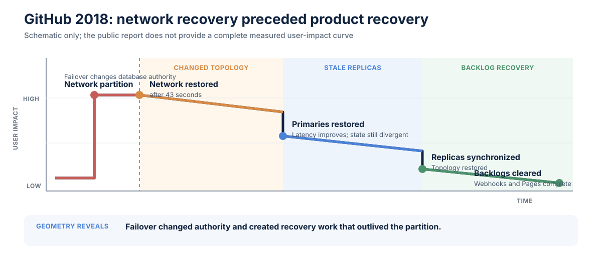

# GitHub database failover incident, 2018

**Incident:** October 21-22, 2018 
**Primary observable:** Availability and freshness of GitHub user workflows 
**Evidence status:** Operator incident analysis 
**Classification status:** Project interpretation

## Reported facts

A 43-second loss of connectivity during network maintenance triggered a chain
of database failovers. After connectivity returned, East Coast and West Coast
database clusters contained writes absent from the other site, preventing an
immediate safe return to the original topology. GitHub prioritized data
integrity while rebuilding replication and restoring service.[^gh]

GitHub reported degraded service for 24 hours and 11 minutes. During recovery,
the system accumulated more than five million webhook events and 80,000 Pages
builds. GitHub kept status degraded until the backlog was processed and system
integrity and operation were confirmed.[^gh]

## Classification

| Layer | Reading |
| --- | --- |
| User-impact curve | Sustained degradation followed by **long-tail recovery**; exact curve not reconstructed |
| Causal geometry | Database-topology **cascade** and backlog accumulation |
| Amplification | Divergent writes, replication rebuild, and deferred work |
| Supporting properties | Recovery asymmetry, authority shift, and freshness/availability divergence |

## Geometry of incidents diagram

The curve is schematic. GitHub's public report provides recovery milestones but
not a complete user-impact time series.

## TRACER analysis

### Trigger / origin

Routine network maintenance caused a brief loss of connectivity between an
East Coast network hub and the primary East Coast data center.

### Route / propagation

The partition triggered database orchestration, changed primary placement, and
allowed writes to diverge across sites. Application freshness and dependent
background workflows inherited the database recovery state.

### Amplification

The 43-second partition created more than a day of reconciliation work.
Replication repair, integrity checks, and the webhook and Pages backlogs each
had their own completion criteria.

### Consequence / impact

Users experienced stale and inconsistent information, while webhooks and Pages
publishing were unavailable for much of the incident.[^gh]

### Extent / containment

GitHub deliberately limited some metadata-producing activity to protect
integrity. The failover boundary preserved database availability in a narrow
sense but did not preserve the full product contract of correct, current data
and functioning derived workflows.

### Recovery

Recovery required rebuilt replicas, a safe database topology, and controlled
backlog drain so GitHub and its ecosystem partners were not overloaded. A
working database primary was therefore an intermediate milestone, not full
user-level recovery.

## Architectural finding

Failover is a topology transition, not proof of product recovery. The recovery
definition must include correctness, freshness, derived work, and backlog
clearance.

[^gh]: GitHub, [October 21 post-incident analysis](https://github.blog/news-insights/company-news/oct21-post-incident-analysis/), October 30, 2018.
